# API Sequence Diagrams

## 🔄 User Interaction Flows

### 1. Vendor Creates Store via API

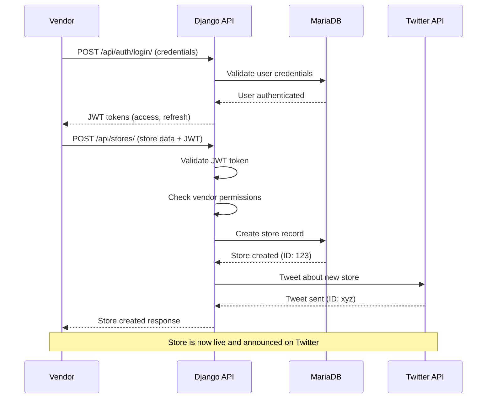

### 2. Vendor Adds Product via API

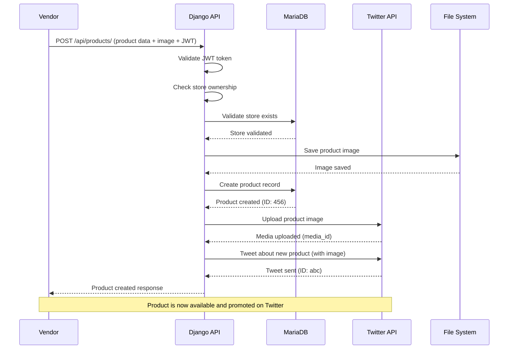

### 3. Buyer Retrieves Stores and Products

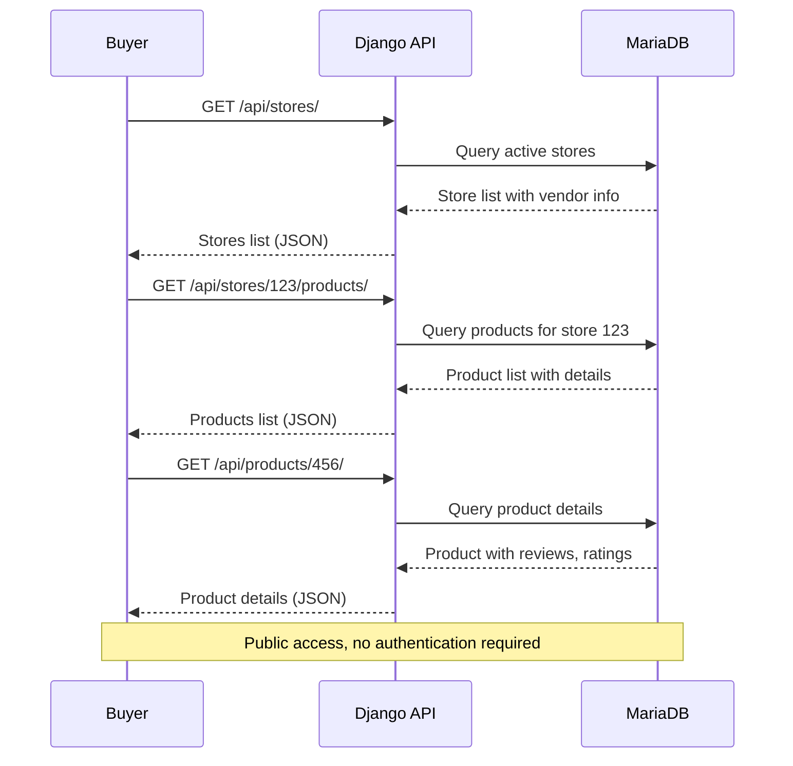

### 4. Buyer Creates Product Review

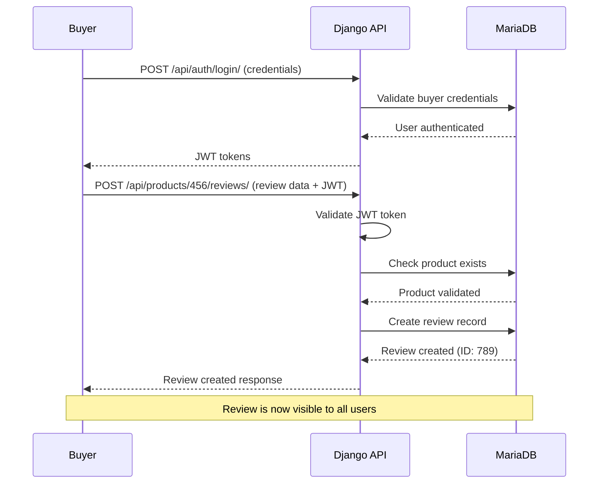

### 5. Vendor Retrieves Own Resources

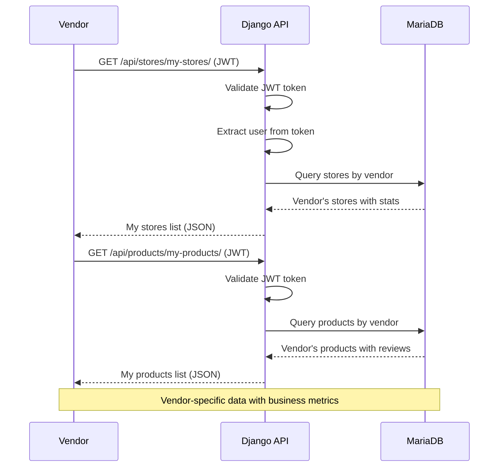

### 6. Public Access to Vendor Resources

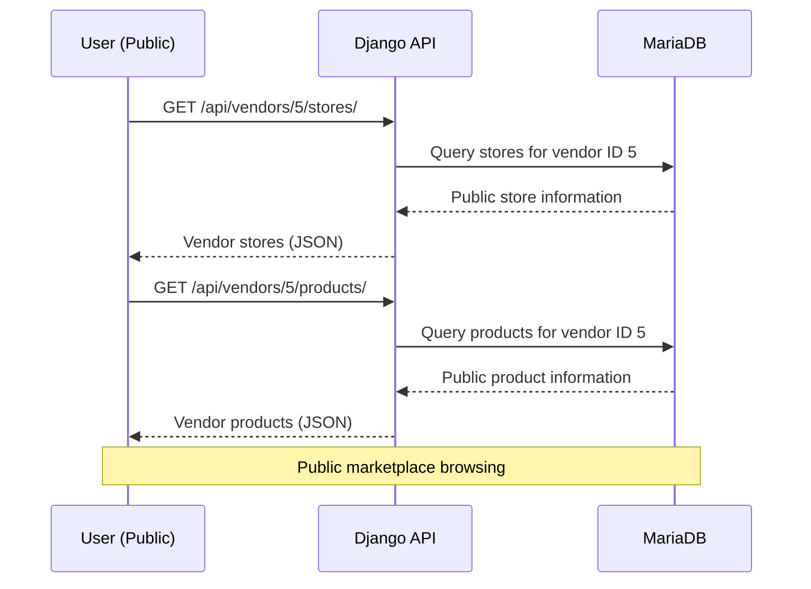

## 🔐 Authentication Flow Details

### JWT Token Lifecycle

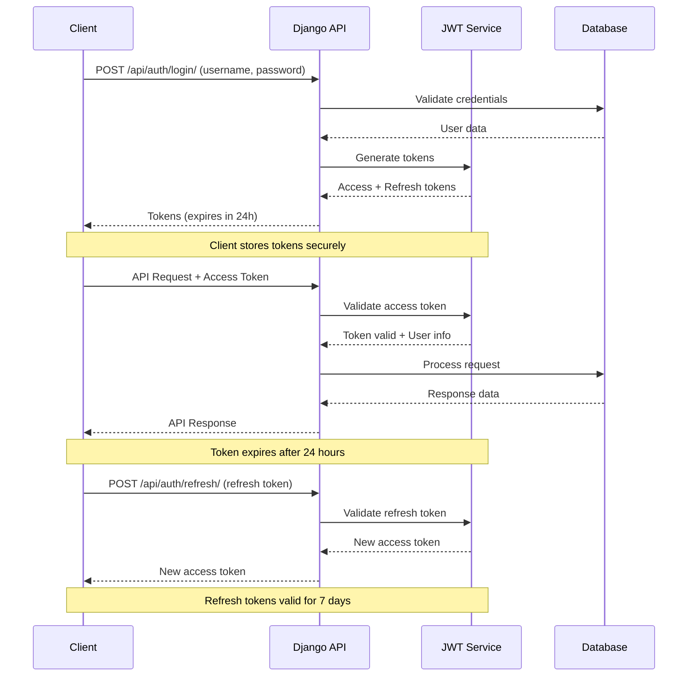

## 🐦 Twitter Integration Flow

### Store Tweet Process

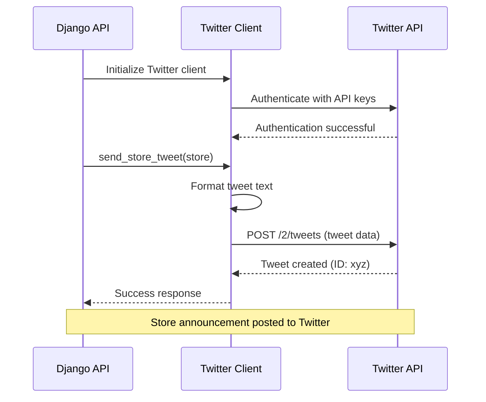

### Product Tweet with Media

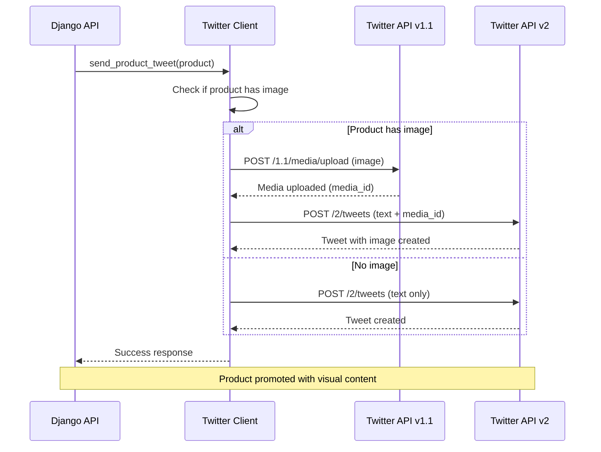

## 🔄 Error Handling Flows

### API Error Response

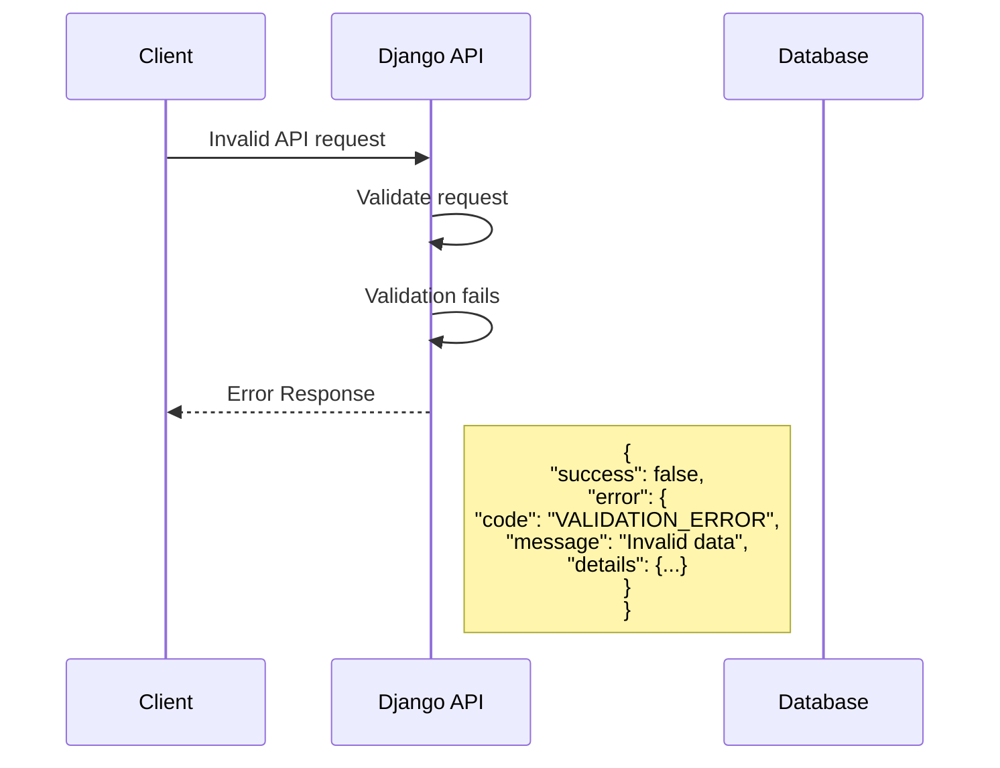

### Twitter Integration Error Handling

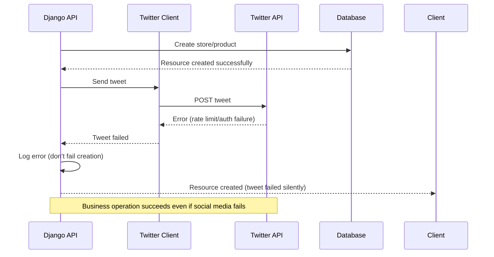

## 📊 Data Flow Summary

### Request/Response Patterns

1. **Authentication Required Endpoints**
   - All POST, PUT, DELETE operations
   - Vendor-specific endpoints (/my-stores/, /my-products/)
   - Review creation

2. **Public Access Endpoints**
   - GET /api/stores/
   - GET /api/products/
   - GET /api/vendors/{id}/stores/
   - GET /api/vendors/{id}/products/
   - GET /api/products/{id}/reviews/

3. **Permission-Based Access**
   - Store owners can edit their stores
   - Product owners can edit their products
   - Review authors can edit their reviews
   - Vendors can create stores and products

4. **Social Media Integration**
   - Automatic tweets on resource creation
   - Media upload for visual content
   - Graceful error handling
   - Rate limit compliance

This API design ensures secure, scalable, and user-friendly access to your eCommerce platform while maintaining proper separation of concerns and following REST best practices.